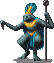
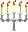
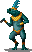
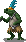
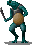
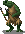

# Stahlkrötefabrik: The Workshop Below

## Lore
Stahlkrötenfabrik is a network of iron and coal-rich caves deep below the surface. When Klaus, the heretical sorcerer of Ulm, fled into the depths of the earth from the persecution of the Iron Inquisition, he discovered the resource rich caves of the Muuch, a primitive and pliable people. Teaching them the arts of industry and the making of steel, Klaus has organized the simpleminded Muuch into Stahlkrötenfabrik, the Workshop Below. Now Muuch clad in full steel armor of ingenious Ulmish design prepare to goose step forward rank by rank.

Little do the Xibalbans know: Klaus is the chief weaponsmith of the Bacab of the North, Cantzincal, an ancient creature of the deep waters. Soon Klaus will outfit Cantzincal with a suit of the finest treasures of the depths forged into an exquisite suit of Black Steel so that Cantzincal might wreak his havoc against the sky he once upheld. But when the sky falls at the hands of Cantzincal, so shall the Iron Inquisition and the bigots of Ulm with it.

## General Overview

The Xibalbans of Stalkrötefabrik prefers cold steel and protective magic.

## Comanders
Sprite | Name | Details 
--- | --- | ---
 | **Stalkröte Bacab** | 2312+1()  Slow to recruit  Capital only
 | **Stalkröte Muuch Kuhul** | 1211+1()   Larger
 | **Stalkröte Ah Ha'** | 111  Forge bonus (1)

## Units
Sprite | Name | Details
--- | --- | ---
 | **Stalkröte Slayer** | Sacred  Capital only Full Chain Mail Full Helmet
 | **Stalkröte Tormentor** | Spetum Full Helmet
 | **Stalkröte Sniper** | Crossbow Precision +2

## National Spells
Name | Cost | Details
--- | --- | ---
Summon Monster Toad | 2+2 gems Conj. 5 | Summons Monster Toad
Summon Balam | 4+60 gems  Conj. 7 | Summons one of the four unique Balam, powerful jaguar spirits of fertility
Summon Chaac | 4+75 gems Conj. 8 | Summons one of the four unique Chaac, powerful spirits of thunder and rain
Iron Blizzard | 11  Evo. 6 | Throws 30 cold iron darts dealing 10 magical armor piercing damage each.
Living Mercury | 11 + 7 gems Ench. 5 | Summons Living Mercury
Tempering the Will | 3 | Increase magic resistant of all friendly soldiers.

